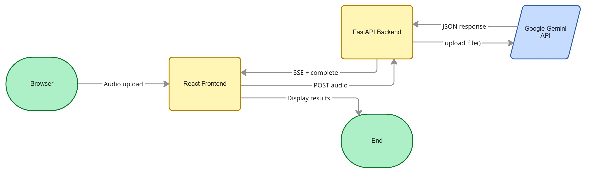
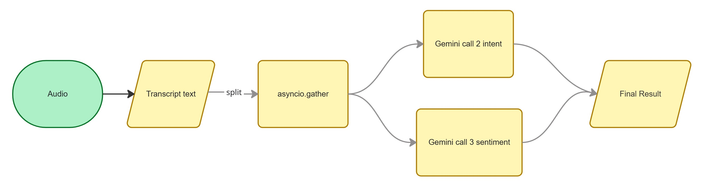

# Sentivo — Call Intelligence

Upload or record a phone call and get back a full transcript, speaker-by-speaker sentiment, and intent classification.

---

## Quick start

**Prerequisites:** Python 3.9+, Node 18+, a Gemini API key.

```bash
# 1. Clone
git clone https://github.com/Nancy-30/Sentivo
cd sentivo

# 2. Create your env file
cp backend/.env.example backend/.env

# 3. Run
chmod +x start.sh   # macOS / Linux only
./start.sh          # Windows: bash start.sh (Git Bash)
```

#### The service will start on http://localhost:8000
---

### Alternative

```bash
python -m venv venv
source /venv/Scripts/activate

# Terminal 1 — backend
cd backend
pip install -r requirements.txt
uvicorn main:app --reload --port 8000

# Terminal 2 — frontend (hot-reload dev server, proxies /api to port 8000)
cd frontend
npm install
npm run dev
```

- Frontend dev server: **http://localhost:5173**
- Backend + API docs: **http://localhost:8000/docs**

---

## Architecture


**How it works**

1. User uploads a file or records from the microphone.
2. FastAPI validates the MIME type and size, then uploads the raw audio bytes to Gemini's file API.
3. A `generate_content` call sends the uploaded file + prompt to Gemini.
4. The backend streams three SSE status events back to the browser while it waits, so the user sees live progress.
5. When Gemini responds, the JSON is parsed into typed Pydantic models and sent as the final SSE `complete` event.
6. React renders the transcript, intent bars, sentiment timeline, and an audio player.
---

## The Gemini prompt

The entire analysis — transcription, speaker diarisation, intent classification, and sentiment — is handled by a single prompt:

```
"""You are an expert call intelligence analyst. Listen to this audio recording carefully.

Perform ALL of the following and return ONLY a valid JSON object — no markdown fences, no extra text:

1. Transcribe the entire conversation. Identify each distinct speaker as "Speaker 1", "Speaker 2", etc.
2. Detect the intent of the call.
3. Analyze the sentiment of each speaker and the overall conversation.

Return this exact JSON structure:

{
  "transcript": {
    "full_text": "<complete transcript as a single readable string>",
    "segments": [
      {
        "speaker": "<Speaker 1 | Speaker 2 | ...>",
        "text": "<what this speaker said in this segment>",
        "start": <approximate start time in seconds, float>,
        "end": <approximate end time in seconds, float>
      }
    ],
    "speakers_detected": <number of distinct speakers, integer>,
    "duration_seconds": <total audio duration in seconds, float>
  },
  "intent": {
    "primary_intent": "<concise label for the dominant intent>",
    "intents": [
      {
        "intent": "<intent label>",
        "confidence": <0.0 to 1.0>,
        "description": "<one sentence explaining this intent>"
      }
    ],
    "summary": "<2-3 sentence plain-English summary of what the call is about>"
  },
  "sentiment": {
    "overall_sentiment": "<positive|neutral|negative>",
    "overall_score": <-1.0 to 1.0>,
    "speaker_sentiments": [
      {
        "speaker": "<speaker label>",
        "sentiment": "<positive|neutral|negative>",
        "score": <-1.0 to 1.0>,
        "key_phrases": ["<phrase that most reveals their sentiment>"]
      }
    ],
    "progression": [
      {
        "segment_index": <integer starting from 0>,
        "speaker": "<speaker label>",
        "text_snippet": "<first ~10 words of the segment>",
        "sentiment": "<positive|neutral|negative>",
        "score": <-1.0 to 1.0>
      }
    ],
    "summary": "<2-3 sentence narrative of the emotional arc of the conversation>"
  }
}

Intent label examples: Product Inquiry, Technical Support, Billing Dispute, Cancellation Request,
Complaint, Demo Request, Onboarding Help, General Inquiry, Sales Pitch, Feedback.
overall_score: 1.0 = very positive, 0.0 = neutral, -1.0 = very negative.
If only one speaker is audible, label them "Speaker 1" throughout. """
```

**Approach:**
- I used one prompt for transcripts, intent and sentiment analysis to avoid API overheads, simple design and easy to code.
- Strictly prompted gemini to return only valid JSON object.
- Used sse for streaming the response to the frontend to show progress to the user.
---

## Trade-offs and what I'd do with another week

### Trade-offs made
- All analysis depends on Gemini. If transcription quality drops, intent/sentiment also gets affected.
- Results are only stored in the browser tab. Reloading the page will result in loss of analysis data since no database or history is implemented.
- Fixed audio format while recording live transcripts.


### With another week
- Reduce latency by implementing parallel tool calls for intent and sentiment analysis.
- Improve speaker detection by fixing incorrect speaker switches during post-processing.
- Add SQLite storage and shareable links so users can save and revisit past analyses.
- Stream transcripts live while sentiment and intent analysis continue in the background.



